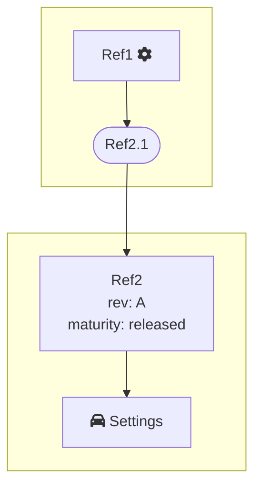

# Basic Rules

## Effectivity-Based Revision Mode

Products created with **effectivity-based** revision mode:
- Cannot be revised
- Maturity remains **In Work** permanently

## Explicit Revision Mode

Products created with **explicit** revision mode:
- Can be revised to create new versions
- Maturity state can be changed
- **Released** state indicates the product is finalized

---

